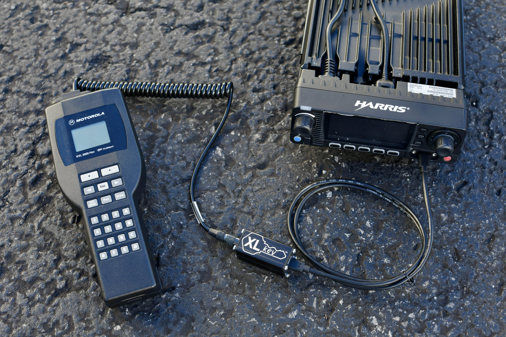

**XL**key™
============

The **XL**key is a P25 keyloading adapter that enables the use of TIA-102 standards-compliant keyloaders with L3Harris XL-series mobile radios.

It provides comparable functionality to the L3Harris 14050-6350-01 and -02 keyloading cables.

## 🛒 [Order now!](https://shop.beepbooplabs.ltd/products/xlkey)

## Usage instructions

### 1. Plug keyloader hirose cable into **XL**key

Connect the keyloader's male hirose connector to the `KFD` port on the **XL**key:

### 2. Plug **XL**key into the radio

Connect the provided USB-C cable to the control head's mic port:

### 3. Enter **KVL MODE** on the radio

Navigate the radio menu to **SECURITY > KVL MODE** and select it.

The radio is now ready to receive keys from the keyloader:

## Example usage

## Compatibility

The **XL**key is guaranteed to work with the following tested radios and keyloaders.

*Have you used a **XL**key with a different radio or keyloader? [Please let us know!](mailto:contact@beepbooplabs.ltd)*

### Radios

The **XL**key is designed to be compatible with all L3Harris XL-series mobile P25 radios, depending on the control head in use.

The following control heads have been tested for compatibility at this time:

| Control head | Support status | Firmware | Notes |
|--------------|----------------|----------|-------|
| XL-CH        | ✅ Tested      | R20A     |
| XL-CH2       | ✅ Tested      | R17C     |
| XL-RHHC      | ✅ Tested      | R21A     | Requires 14002-0174-55 or -71 USB-C to HD-44 cable

### Keyloaders

The **XL**key is designed to meet the requirements of the TIA-102.AACD-A key fill device standard for P25 TWI (three-wire interface) keyloading.

The following TWI keyloaders have been tested for compatibility at this time:

| Keyloader                                                                                                                           | Support status | Firmware                   |
|-------------------------------------------------------------------------------------------------------------------------------------|----------------|----------------------------|
| [beep boop labs **bbl**key](https://github.com/beepbooplabsltd/bblkey)[^trs14tohirose]                                              | ✅ Tested      | 2.0.0                      |
| Motorola KVL 3000[^mxtohirose]                                                                                                      | ✅ Tested      | 2.50.02                    |
| Motorola KVL 3000+[^mxtohirose]                                                                                                     | ✅ Tested      | 3.53.03                    |
| [Motorola KVL 4000](https://www.motorolasolutions.com/en_us/products/p25-products/security/kvl-4000.html)[^mxtohirose]              | ✅ Tested      | 1.3.5000.218 / SA R2.7.28  |
| [Motorola KVL 5000](https://www.motorolasolutions.com/en_us/products/p25-products/security/kvl-5000.html)[^mxtohirose]              | ✅ Tested      | R01.08.01.00 / HSM 50.7.10 |
| [Motorola KVL 7000](https://www.motorolasolutions.com/en_us/products/p25-products/security/kvl-7000.html)[^gcaitohirose]            | ❔ Untested    | —                          |
| [Tait EnableProtect KFD](https://www.taitcommunications.com/products/tait-enable-network-management/enableprotect#KFD)[^taittiabox] | ❔ Untested    | —                          |
| [KFDtool](https://store.kfdtool.com/)[^hirosetohirose]                                                                              | ✅ Tested      | 1.3.0                      |
| [KFDmini](https://www.ebay.com/itm/144716303249)[^trs17tohirose]                                                                    | ✅ Tested      | 1.3.0                      |
| KFDnano *([@alexhanyuan](https://github.com/alexhanyuan))*[^trs14tohirose]                                                         | ✅ Tested      | 1.8.7                      |
| [KFDnano](https://www.ebay.com/usr/rentfrowj) *([@rentfrowj](https://github.com/rentfrowj))*[^hirosetohirose][^mxtohirose]         | ✅ Tested      | 1.8.7                      |
| [KFDmicro](https://store.w3axl.com/products/kfdmicro-3d-printed-case-1)[^trs14tohirose]                                             | ✅ Tested      | 1.8.7                      |
| [KFDpico](https://www.ebay.com/itm/297004299797)[^trs14tohirose]                                                                    | ✅ Tested      | 1.7.3                      |

## Legal

The names "beep boop labs" and "**XL**key", and the alembic distiller and key logos, are trademarks and/or copyrighted works of beep boop labs ltd. All rights are reserved.

Any reference to KFDtool, L3Harris, Motorola, or any other third party manufacturer, or any of their products, is for informational purposes only. No representation is made that any such manufacturer has endorsed beep boop labs ltd or its products.

[^gcaitohirose]: Requires Motorola [unreleased part number] portable GCAI to hirose male cable.
[^hirosetohirose]: Requires KFDtool AC100 hirose male to hirose male cable.
[^mxtohirose]: Requires Motorola TKN8531 MX to hirose male cable.
[^taittiabox]: Requires Tait T03-00059-AAAA KFD to TIA radio adapter.
[^trs14tohirose]: Requires 3.5mm TRS (14mm) to hirose male cable.
[^trs17tohirose]: Requires 3.5mm TRS (17mm) to hirose male cable.
